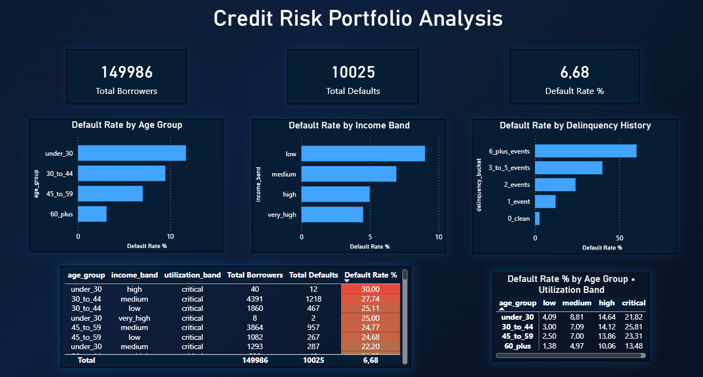

# Credit Risk Portfolio Analysis

> **Can we identify which borrowers are most likely to default — before they do?**  
> This project answers that question through a full analytical pipeline built on PostgreSQL, Python, and Power BI.

---

## The Business Problem

A consumer lending institution is sitting on a portfolio of **150,000 loans** with a **6.68% default rate** — meaning roughly 1 in 15 borrowers will fail to repay.

The problem is not the average. The problem is that the risk is not evenly distributed.

Some segments of borrowers default at **22%+**. Others default at less than **2%**. If the institution treats all borrowers the same way, it is either leaving money on the table by being too conservative with safe borrowers, or exposing itself to unnecessary losses by being too lenient with risky ones.

The goal of this project is to **identify where the risk lives**, quantify it, and present it in a way that supports credit policy decisions.

---

## What I Found

### 1. Credit utilization is the single strongest predictor of default

Borrowers using more than 90% of their available credit limit — the `critical` utilization band — default at rates between **19% and 26%**, regardless of age or income.

A high-income borrower with critical utilization still defaults at **25.81%**.  
A low-income borrower with low utilization defaults at just **1.38%**.

> **Income alone does not protect a borrower. Behavior does.**

### 2. A single delinquency event is already a strong warning signal

| Delinquency History | Default Rate |
|---|---|
| No late payments | 2.7% |
| 1 late payment | 12.2% |
| 2 late payments | 24.1% |
| 3–5 late payments | 40.0% |
| 6+ late payments | 60.2% |

One missed payment multiplies default risk by **4.5x**.  
Six or more missed payments pushes the default rate to **60%** — meaning the majority of these borrowers will default.

### 3. Risk is concentrated in a small number of segments

The top segments by default rate account for a disproportionate share of all losses. This concentration pattern means that **targeted interventions on a small subset of the portfolio could significantly reduce total default exposure**.

### 4. Younger borrowers carry higher risk — but not for the reason you might think

The `under_30` group has the highest default rate overall. But within that group, borrowers with low utilization default at just **4.09%** — comparable to older segments.

The risk driver is **behavioral**, not demographic.

---

## Dashboard

The findings above are presented in an interactive Power BI dashboard with:

- **KPI cards** — portfolio-level summary (total borrowers, defaults, default rate)
- **Bar charts** — default rate by age group, income band, and delinquency history
- **Matrix with conditional formatting** — utilization band × age group heatmap
- **Segment table** — top risk segments ranked by default rate



---

## Technical Architecture
```
Kaggle CSV (150k rows)
        ↓
PostgreSQL — loans_raw
        ↓
PostgreSQL — loans_clean
(layered CTEs, null imputation, feature engineering)
        ↓
PostgreSQL — analytical queries
(window functions, CTEs, risk segmentation)
        ↓
Python + Pandas
(extraction, metric computation, CSV export)
        ↓
Power BI Dashboard
(KPIs, bar charts, matrix, segment table)
```

---

## Tech Stack

| Layer | Tool | Purpose |
|---|---|---|
| Database | PostgreSQL 15 (Docker) | Schema, cleaning, analytical queries |
| SQL Patterns | CTEs + Window Functions | Segmentation, ranking, concentration |
| Data Layer | Python + Pandas + SQLAlchemy | Extraction and metric computation |
| Dashboard | Power BI Desktop | Interactive business dashboard |
| Version Control | Git — feature branch strategy | Clean, reviewable history |

---

## SQL Highlights

**Layered CTEs — cleaning applied once, reused downstream:**
```sql
WITH median_income AS (
    SELECT PERCENTILE_CONT(0.5) WITHIN GROUP (ORDER BY monthly_income) AS median_val
    FROM loans_raw WHERE monthly_income IS NOT NULL
),
cleaned AS (
    SELECT *, COALESCE(monthly_income, (SELECT median_val FROM median_income)) AS monthly_income
    FROM loans_raw WHERE age BETWEEN 18 AND 100
),
enriched AS (
    SELECT *,
        CASE WHEN monthly_income < 3000 THEN 'low' ... END AS income_band
    FROM cleaned
)
SELECT * FROM enriched;
```

**Window functions — cumulative default concentration:**
```sql
SUM(total_defaults * 100.0 / grand_total_defaults) OVER (
    ORDER BY default_rate_pct DESC
    ROWS BETWEEN UNBOUNDED PRECEDING AND CURRENT ROW
) AS cumulative_default_share_pct
```

---

## How to Run

### Prerequisites
- Docker Desktop
- Python 3.11+
- Power BI Desktop
- Kaggle account (to download the dataset)

### Setup
```powershell
# 1. Clone the repo
git clone https://github.com/thiagofsdata-collab/credit-risk-analysis.git
cd credit-risk-analysis

# 2. Create and activate virtual environment
python -m venv .venv
.venv\Scripts\Activate.ps1

# 3. Install dependencies
pip install -r requirements.txt

# 4. Start PostgreSQL
docker run --name credit-risk-db -e POSTGRES_PASSWORD=postgres -p 5432:5432 -d postgres:15

# 5. Create credentials file at config/db_config.env
# DB_HOST=localhost | DB_PORT=5432 | DB_NAME=credit_risk | DB_USER=postgres | DB_PASSWORD=postgres

# 6. Download cs-training.csv from Kaggle and place at data/raw/cs-training.csv
# https://www.kaggle.com/competitions/GiveMeSomeCredit/data

# 7. Load and process data
docker exec -it credit-risk-db psql -U postgres -c "CREATE DATABASE credit_risk;"
python src/ingestion/load_data.py
Get-Content sql\schema\02_create_clean_table.sql | docker exec -i credit-risk-db psql -U postgres -d credit_risk

# 8. Run analysis and export CSVs
python src/analysis/credit_risk_analysis.py

# 9. Open Power BI
# Connect to localhost / credit_risk / loans_clean
# Or open outputs/credit_risk_dashboard.pbix directly
```

---

## Dataset

**Source:** [Give Me Some Credit — Kaggle](https://www.kaggle.com/competitions/GiveMeSomeCredit/data)  
**Size:** 150,000 borrower records  
**Target:** `SeriousDlqin2yrs` — 90+ day delinquency within 2 years

Raw data is not versioned. See setup instructions above.

---

## Next Steps

- **Power BI Service** — publish dashboard online for public access
- **Probability of Default scoring** — logistic regression to produce borrower-level PD scores
- **IFRS 9 staging** — classify borrowers into Stage 1 / 2 / 3 based on delinquency rules
- **dbt integration** — replace raw SQL scripts with versioned, tested transformations